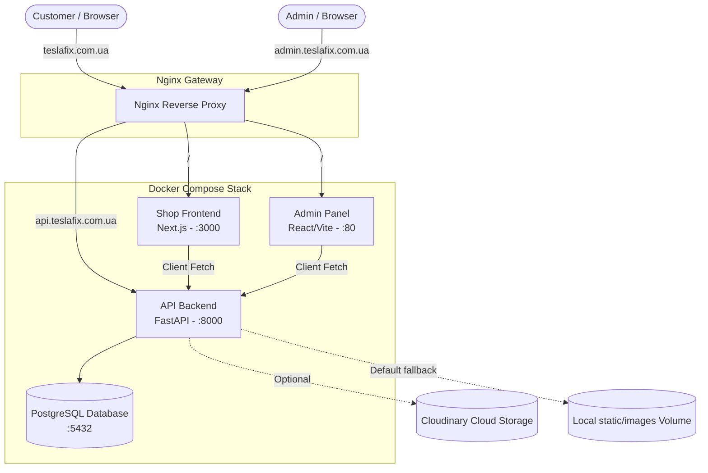

# Tesla Parts App - Code Review & Technical Audit

## Executive Summary
This document provides a comprehensive technical audit and code review of the **Tesla Parts UA** application. The application architecture consists of three interconnected modules running in a containerized environment managed via Docker Compose and Nginx:
1. **`tesla-parts-backend`**: A FastAPI-based REST API built with SQLModel (SQLAlchemy) and Pydantic, supporting SQLite and PostgreSQL databases.
2. **`tesla-parts-admin`**: An administration dashboard built with React (Vite), TypeScript, and TailwindCSS.
3. **`tesla-parts-shop`**: A customer-facing e-commerce storefront built with Next.js (App Router), TypeScript, and TailwindCSS.

### System Architecture Diagram

---

## 1. Backend Module Audit (`tesla-parts-backend`)

### Core Strengths
* **Separation of Concerns**: Excellent modular structure separating schemas, routing layers, database entities, and external integrations (e.g. Telegram, Email).
* **Type Safety & Validation**: Strong adoption of SQLModel and Pydantic ensures clean payload validation and automatic API documentation (Swagger/OpenAPI).
* **Elegant Upload Fallbacks**: The `image_uploader` service is exceptionally well-written. It checks for Cloudinary environment variables dynamically and falls back transparently to local directory mounting if not configured.

### Critical Vulnerabilities & Architectural Issues

> [!WARNING]
> **Ad-hoc Manual Table Migrations in `database.py`**
> * **Location**: `tesla-parts-backend/database.py` (lines 56–150)
> * **Issue**: Instead of adopting a standard database migration engine like Alembic, the backend uses custom-written introspection scripts (`inspect(engine)`) and executes raw `ALTER TABLE` DDL scripts on startup.
> * **Impact**: This is extremely fragile. Schema updates are hard to track, lack automatic rollback capabilities, and contain syntax differences that break across database engines (e.g., SQLite vs PostgreSQL handling of `created_at` timestamps).
> * **Recommendation**: Integrate **Alembic**. It provides structured, version-controlled migrations out of the box and avoids polluting runtime database initialization files with DDL scripts.

> [!CAUTION]
> **Hardcoded and Weak Default Admin Credentials**
> * **Location**: `tesla-parts-backend/database.py` (lines 43–50)
> * **Issue**: When the database initializes, if the `admin` user is missing, it is automatically created with the hardcoded credentials `admin` / `admin123`.
> * **Impact**: Critical security vulnerability. If deployed in production without manual modifications, any third party can compromise the administrative panel, access customer data, and disrupt store operations.
> * **Recommendation**: Pull the default administrator credentials from secure environment variables (e.g., `DEFAULT_ADMIN_USER` and `DEFAULT_ADMIN_PASSWORD`) or disable automatic admin seeding entirely in production.

> [!WARNING]
> **Inefficient O(N) Category Lookups**
> * **Location**: `tesla-parts-backend/routers/products.py` (lines 118–139)
> * **Issue**: The `Category` model does not contain a `slug` field. Consequently, filtering products by a category slug (e.g. via navigation links) requires the backend to fetch **all** categories into memory and scan them sequentially using a Python-level `_slugify` string conversion.
> * **Impact**: As the product catalog grows, this causes massive database and memory overhead. What should be an O(1) indexed query becomes an O(N) sequential search in memory.
> * **Recommendation**: Add a unique, indexed `slug` column to the `Category` table. Generate this slug on category creation/edit. Replace the current memory scan with a direct database query: `select(Category).where(Category.slug == category_slug)`.

> [!NOTE]
> **No Support for Concurrent Multi-Device Sessions**
> * **Location**: `tesla-parts-backend/models.py` (line 116) and `routers/auth.py`
> * **Issue**: The `User` model stores the active session's `refresh_token` as a single string column.
> * **Impact**: Logging in from a secondary device (e.g., a phone) overwrites this field, immediately invalidating the session on the primary device (e.g., a laptop).
> * **Recommendation**: Transition session storage to a separate `UserSession` or `RefreshToken` table with a many-to-one relationship to `User`, enabling concurrent multi-device logins.

> [!WARNING]
> **Refresh Token Expiry is Not Enforced**
> * **Location**: `tesla-parts-backend/routers/auth.py` (lines 75–101)
> * **Issue**: The backend defines a `REFRESH_TOKEN_EXPIRE_DAYS = 7` constant but does not store an expiration date for the admin `refresh_token` in the database, nor does it check for expiry during rotating token exchanges.
> * **Impact**: Admin sessions remain active indefinitely. A compromised refresh token remains valid forever unless a new login forces token rotation.
> * **Recommendation**: Add a `refresh_token_expires_at: Optional[datetime]` field in the `User` model, and reject token refresh requests if the current time exceeds this limit.

---

## 2. Admin Frontend Module Audit (`tesla-parts-admin`)

### Core Strengths
* **Complete Typings**: Highly structured TypeScript models (`Product`, `Order`, `Category`, `Customer`) mirror backend models perfectly, preventing runtime integration mismatches.
* **Strict Route Guards**: Private routes are cleanly wrapped with an `<PrivateRoute>` handler that redirects unauthenticated attempts directly to `/login`.
* **Clean UI Tokens**: Modern and clean design system implemented using `lucide-react` icons and custom Tailwind CSS.

### Critical Vulnerabilities & Architectural Issues

> [!WARNING]
> **Insecure Token Storage in Local Storage (XSS Vulnerability)**
> * **Location**: `tesla-parts-admin/AuthContext.tsx` & `services/api.ts`
> * **Issue**: Administrative authorization tokens (`accessToken` and `refreshToken`) are saved directly inside the browser's `localStorage`.
> * **Impact**: Vulnerability to Cross-Site Scripting (XSS). If a malicious script runs within the browser context (e.g. through a compromised npm package or HTML/JS injected via reviews or product data fields), the attacker can query `localStorage` and steal full administrative access.
> * **Recommendation**: Migrate authentication token handling to secure, `HttpOnly`, `SameSite=Strict`, `Secure` cookies.

> [!WARNING]
> **Race Conditions in Concurrent Token Refresh Handler**
> * **Location**: `tesla-parts-admin/services/api.ts` (lines 74–117)
> * **Issue**: The custom `_authenticatedFetch` wrapper handles token refreshes locally. If multiple parallel REST requests are initiated simultaneously when the access token expires, each will trigger a separate `/refresh-token` call. Since the backend rotates the refresh token on *every* call, only the first call succeeds, causing the subsequent parallel calls to invalidate the session.
> * **Impact**: Random, unpredictable logouts and "Session Expired" errors for administrators while browsing multi-widget dashboards.
> * **Recommendation**: Adopt **Axios** with request interceptors. This allows you to queue outgoing requests during an active token refresh operation, resolving them all cleanly once the new token is acquired.

> [!NOTE]
> **Monolithic Component Structure**
> * **Location**: `tesla-parts-admin/components/CategoryList.tsx` (78.4 KB) and `ProductForm.tsx` (38.2 KB)
> * **Issue**: These components are extremely large, handling hundreds of lines of complex JSX, internal state management, layout rendering, drag-and-drop operations, and direct API executions inside a single monolithic file.
> * **Impact**: High cognitive load, fragile updates, and zero unit-test coverage suitability.
> * **Recommendation**: Refactor major files into smaller, dedicated subcomponents (e.g., `CategoryTree.tsx`, `CategoryRow.tsx`, `FormInput.tsx`) and separate complex state changes into custom hooks.

---

## 3. Shop Frontend Module Audit (`tesla-parts-shop`)

### Core Strengths
* **Polished UX & Micro-animations**: Slick, modern visual storefront using responsive grid layouts, sliding checkout panels, elegant image pre-loading, and interactive theme toggles.
* **SEO Foundation**: Pre-configured JSON-LD structured schema for search engines included globally in the root layout.

### Critical Vulnerabilities & Architectural Issues

> [!CAUTION]
> **Subversion of Next.js SSR / Server-Side Architecture (Severe SEO Penalty)**
> * **Location**: `tesla-parts-shop/app/` (all major pages)
> * **Issue**: Almost every page file (e.g. Home, Product Details, Category Details) is decorated with `'use client';` and fetches raw catalog data client-side inside standard React `useEffect` hooks.
> * **Impact**: This completely defeats the primary purpose of Next.js (Server-Side Rendering / SSR).
>   1. **Zero SEO Indexability**: Search engines and web scrapers parsing the raw HTML response receive an empty page containing only a loading spinner. They cannot index product descriptions, prices, or specifications.
>   2. **Poorer Core Web Vitals**: Page loads require multiple serial round-trips (fetch JS -> execute JS -> fetch API data -> render layout), causing layout shifts and slow Time-to-Interactive (TTI) metrics.
> * **Recommendation**: Redesign pages to utilize **React Server Components (RSC)**. Fetch the data directly on the server (using Next.js cache and ISR policies) and output pre-rendered, fully-hydrated catalog HTML. Limit `'use client';` strictly to interactive component leaves (e.g. Header Search, Shopping Cart Drawer, Checkout forms).

> [!CAUTION]
> **Client-Side SEO Meta Injection**
> * **Location**: `tesla-parts-shop/components/SeoHead.tsx`
> * **Issue**: Because pages are client-rendered, the `SeoHead` component manages meta titles, descriptions, open-graph tags, and schema attributes dynamically inside a `useEffect` by manually manipulating the browser DOM.
> * **Impact**: Standard web crawlers do not wait for client JS execution to evaluate custom DOM manipulations. They will see the generic default title ("Магазин запчастин") and description from `layout.tsx` for *every* product page, causing search engines to flag the entire store as duplicate content.
> * **Recommendation**: Standardize on Next.js's built-in **Metadata API** using `generateMetadata()` at the server component page level, rendering perfect static SEO tags directly into the header.

> [!WARNING]
> **Race Conditions on Continuous Cart Database Synchronization**
> * **Location**: `tesla-parts-shop/context/AppContext.tsx` (lines 271–282)
> * **Issue**: Every quantity edit or item addition triggers an immediate server API update (`api.saveCart()`) without any delay or debounce protection.
> * **Impact**: Quick clicks by customers (e.g., clicking '+' multiple times rapidly) fire parallel HTTP operations. Due to network latency variations, an older sync call may resolve *after* a newer one, overwriting the database state with stale cart values.
> * **Recommendation**: Add a **debounce utility** (e.g. wait 500ms before sending sync requests) or apply an `AbortController` to cancel previous pending network calls before initiating new ones.

---

## Cross-Cutting Architectural Recommendations

1. **Security & Secrets Integrity**:
   * Critical secrets (e.g., `POSTGRES_PASSWORD`, `JWT_SECRET_KEY`) are committed directly to `docker-compose.yml` in plain text. Extract these keys immediately into an uncommitted `.env` file added to `.gitignore`.
2. **Standardize State Managers / Data Query Libraries**:
   * Refactor the current custom fetch wrappers and local page states (`loading`, `error`, `data`) in the admin and shop modules to a standard query manager like **TanStack Query (React Query)**. This resolves caching, out-of-box query deduplication, auto-retries, and state management cleanly.
3. **Database Integrity & Foreign Keys**:
   * Ensure explicit database cascading rules are set in models. Currently, deleting a category or subcategory with linked products can cause orphaned states or unexpected query crashes. Specify direct `ondelete="RESTRICT"` or `ondelete="CASCADE"` constraints in SQLModel definitions.
